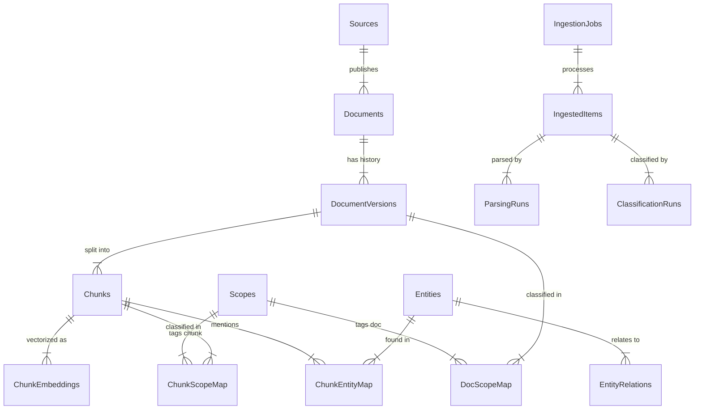

# Big SIS V2 - Database Schema Architecture

## 1. Overview & Diagrams

This architecture is designed for a **Retrieval-Augmented Generation (RAG)** system where **auditability**, **versioning**, and **scalability** are critical. It moves away from simple key-value storage to a structured knowledge base.

### Entity-Relationship Diagram (ASCII)



## 2. Database Schema (PostgreSQL)

```sql
-- Extensions
CREATE EXTENSION IF NOT EXISTS "uuid-ossp";
CREATE EXTENSION IF NOT EXISTS "vector"; -- Requires pgvector

-- ==========================================
-- 1. Reference Data & Sources
-- ==========================================

CREATE TABLE sources (
  id              UUID PRIMARY KEY DEFAULT uuid_generate_v4(),
  name            TEXT NOT NULL,
  source_type     TEXT NOT NULL CHECK (source_type IN ('pubmed','journal','society','institution','website','internal')),
  homepage_url    TEXT,
  notes           TEXT,
  created_at      TIMESTAMPTZ NOT NULL DEFAULT now()
);

CREATE TABLE documents (
  id              UUID PRIMARY KEY DEFAULT uuid_generate_v4(),
  source_id       UUID REFERENCES sources(id),
  external_type   TEXT NOT NULL CHECK (external_type IN ('pmid','doi','url','file','internal')),
  external_id     TEXT,
  title           TEXT,
  language        TEXT DEFAULT 'en',
  doc_type        TEXT NOT NULL CHECK (doc_type IN ('paper','guideline','consensus','review','webpage','note')),
  created_at      TIMESTAMPTZ NOT NULL DEFAULT now(),
  UNIQUE (external_type, external_id)
);

CREATE TABLE document_versions (
  id                UUID PRIMARY KEY DEFAULT uuid_generate_v4(),
  document_id       UUID NOT NULL REFERENCES documents(id) ON DELETE CASCADE,
  version_no        INT NOT NULL,
  status            TEXT NOT NULL CHECK (status IN ('draft','in_review','published','rejected','quarantined')),
  published_at      TIMESTAMPTZ,
  content_hash      TEXT NOT NULL,
  raw_storage_uri   TEXT,
  extracted_text    TEXT,
  extraction_quality REAL DEFAULT 0,
  created_by        TEXT,
  created_at        TIMESTAMPTZ NOT NULL DEFAULT now(),
  UNIQUE (document_id, version_no)
);
CREATE INDEX idx_docver_document ON document_versions(document_id);
CREATE INDEX idx_docver_status ON document_versions(status);


-- ==========================================
-- 2. Taxonomy & Scopes
-- ==========================================

CREATE TABLE scopes (
  id            UUID PRIMARY KEY DEFAULT uuid_generate_v4(),
  scope_key     TEXT NOT NULL UNIQUE,  -- e.g., "aesthetics.non_invasive.wrinkles.forehead"
  name          TEXT NOT NULL,
  description   TEXT,
  parent_id     UUID REFERENCES scopes(id),
  created_at    TIMESTAMPTZ NOT NULL DEFAULT now()
);
CREATE INDEX idx_scopes_parent ON scopes(parent_id);

CREATE TABLE doc_scope_map (
  id                  UUID PRIMARY KEY DEFAULT uuid_generate_v4(),
  document_version_id UUID NOT NULL REFERENCES document_versions(id) ON DELETE CASCADE,
  scope_id            UUID NOT NULL REFERENCES scopes(id),
  relevance_score     REAL NOT NULL DEFAULT 0,
  assigned_by         TEXT NOT NULL CHECK (assigned_by IN ('classifier','human','rule')),
  created_at          TIMESTAMPTZ NOT NULL DEFAULT now(),
  UNIQUE(document_version_id, scope_id)
);


-- ==========================================
-- 3. RAG Core (Chunks & Embeddings)
-- ==========================================

CREATE TABLE chunks (
  id                  UUID PRIMARY KEY DEFAULT uuid_generate_v4(),
  document_version_id UUID NOT NULL REFERENCES document_versions(id) ON DELETE CASCADE,
  chunk_no            INT NOT NULL,
  text                TEXT NOT NULL,
  char_start          INT,
  char_end            INT,
  section_title       TEXT,
  language            TEXT DEFAULT 'en',
  text_hash           TEXT NOT NULL,
  created_at          TIMESTAMPTZ NOT NULL DEFAULT now(),
  UNIQUE(document_version_id, chunk_no)
);
CREATE INDEX idx_chunks_docver ON chunks(document_version_id);
CREATE INDEX idx_chunks_fts ON chunks USING GIN (to_tsvector('english', text));

CREATE TABLE chunk_scope_map (
  id            UUID PRIMARY KEY DEFAULT uuid_generate_v4(),
  chunk_id      UUID NOT NULL REFERENCES chunks(id) ON DELETE CASCADE,
  scope_id      UUID NOT NULL REFERENCES scopes(id),
  relevance_score REAL NOT NULL DEFAULT 0,
  created_at    TIMESTAMPTZ NOT NULL DEFAULT now(),
  UNIQUE(chunk_id, scope_id)
);

-- Optional: If using PGVector locally within Postgres
-- CREATE TABLE chunk_embeddings (
--   chunk_id      UUID PRIMARY KEY REFERENCES chunks(id) ON DELETE CASCADE,
--   model         TEXT NOT NULL,
--   embedding     vector(1536), -- 1536 for example (openai small)
--   created_at    TIMESTAMPTZ NOT NULL DEFAULT now()
-- );


-- ==========================================
-- 4. Ingestion Pipeline & Audit
-- ==========================================

CREATE TABLE ingestion_jobs (
  id            UUID PRIMARY KEY DEFAULT uuid_generate_v4(),
  job_type      TEXT NOT NULL,
  status        TEXT NOT NULL,
  params        JSONB NOT NULL DEFAULT '{}'::jsonb,
  started_at    TIMESTAMPTZ,
  finished_at   TIMESTAMPTZ,
  created_at    TIMESTAMPTZ NOT NULL DEFAULT now()
);

CREATE TABLE ingested_items (
  id              UUID PRIMARY KEY DEFAULT uuid_generate_v4(),
  ingestion_job_id UUID NOT NULL REFERENCES ingestion_jobs(id) ON DELETE CASCADE,
  external_type    TEXT NOT NULL,
  external_id      TEXT NOT NULL,
  status           TEXT NOT NULL,
  error_message    TEXT,
  created_at       TIMESTAMPTZ NOT NULL DEFAULT now()
);

CREATE TABLE classification_runs (
  id              UUID PRIMARY KEY DEFAULT uuid_generate_v4(),
  ingested_item_id UUID NOT NULL REFERENCES ingested_items(id) ON DELETE CASCADE,
  classifier_name  TEXT NOT NULL,
  decision         TEXT NOT NULL,
  top_scopes       JSONB NOT NULL DEFAULT '[]'::jsonb,
  created_at       TIMESTAMPTZ NOT NULL DEFAULT now()
);

-- ==========================================
-- 5. Knowledge Graph (Minimal)
-- ==========================================

CREATE TABLE entities (
  id            UUID PRIMARY KEY DEFAULT uuid_generate_v4(),
  entity_type   TEXT NOT NULL,
  name          TEXT NOT NULL,
  canonical_key TEXT NOT NULL,
  created_at    TIMESTAMPTZ NOT NULL DEFAULT now(),
  UNIQUE(entity_type, canonical_key)
);

CREATE TABLE entity_relations (
  id             UUID PRIMARY KEY DEFAULT uuid_generate_v4(),
  from_entity_id UUID NOT NULL REFERENCES entities(id) ON DELETE CASCADE,
  relation_type  TEXT NOT NULL,
  to_entity_id   UUID NOT NULL REFERENCES entities(id) ON DELETE CASCADE,
  strength       REAL DEFAULT 0,
  created_at     TIMESTAMPTZ NOT NULL DEFAULT now()
);

CREATE TABLE chunk_entity_map (
  id        UUID PRIMARY KEY DEFAULT uuid_generate_v4(),
  chunk_id  UUID NOT NULL REFERENCES chunks(id) ON DELETE CASCADE,
  entity_id UUID NOT NULL REFERENCES entities(id) ON DELETE CASCADE,
  confidence REAL DEFAULT 0,
  created_at TIMESTAMPTZ NOT NULL DEFAULT now(),
  UNIQUE(chunk_id, entity_id)
);
```

## 3. Standard Operational Queries

### A. Ingest a New Document (Idempotent)
Check if document exists, insert if not.
```sql
WITH upsert_doc AS (
    INSERT INTO documents (source_id, external_type, external_id, title, doc_type)
    VALUES ($source_uuid, 'pmid', '123456', 'Botox efficiency...', 'paper')
    ON CONFLICT (external_type, external_id) DO UPDATE SET title = EXCLUDED.title
    RETURNING id
)
INSERT INTO document_versions (document_id, version_no, status, content_hash, extracted_text)
VALUES ((SELECT id FROM upsert_doc), 1, 'draft', 'sha256_hash_of_text', 'Full extracted text...');
```

### B. Classify & Quarantine
Identify scope. If no valid scope found (or score too low), quarantine.
```sql
-- 1. Insert Classification Run
INSERT INTO classification_runs (ingested_item_id, classifier_name, decision, top_scopes)
VALUES ($item_id, 'scope_classifier_v1', 'in_scope', '[{"scope": "aesthetics.non_invasive", "score": 0.95}]');

-- 2. Link Scope (if in_scope)
INSERT INTO doc_scope_map (document_version_id, scope_id, relevance_score, assigned_by)
SELECT $doc_ver_id, id, 0.95, 'classifier'
FROM scopes WHERE scope_key = 'aesthetics.non_invasive';

-- 3. OR Update Status to Quarantine (if out_of_scope)
UPDATE document_versions 
SET status = 'quarantined' 
WHERE id = $doc_ver_id;
```

### C. RAG Retrieval (Top-K Chunks for "Front Wrinkles")
Retrieve chunks matching embeddings OR keyword search, filtered by relevant scope.
```sql
SELECT 
    c.text, 
    c.chunk_no, 
    d.title, 
    s.name as source_name,
    v.published_at
FROM chunks c
JOIN document_versions v ON c.document_version_id = v.id
JOIN documents d ON v.document_id = d.id
JOIN sources s ON d.source_id = s.id
JOIN doc_scope_map dsm ON v.id = dsm.document_version_id
JOIN scopes sc ON dsm.scope_id = sc.id
WHERE 
    v.status = 'published'
    AND sc.scope_key LIKE 'aesthetics.non_invasive.wrinkles.forehead%'
    -- AND (vector similarity condition if using pgvector)
ORDER BY 
    dsm.relevance_score DESC, 
    v.published_at DESC
LIMIT 5;
```

### D. Audit: Evidence Traceability
Given a generated response ID (stored elsewhere), trace back to source versions.
```sql
-- Assuming you store response -> chunk_ids link in app logs
SELECT 
    d.title,
    d.external_id,
    v.version_no,
    s.name as organization,
    c.text as exact_passage_used
FROM chunks c
JOIN document_versions v ON c.document_version_id = v.id
JOIN documents d ON v.document_id = d.id
JOIN sources s ON d.source_id = s.id
WHERE c.id IN ($chunk_uuid_1, $chunk_uuid_2);
```

## 4. Scalability Strategy

The design supports "Horizontal Scalability of Perimeter" without schema migrations.

1.  **Adding New Zones/Procedures**:
    *   No new tables needed.
    *   Action: `INSERT INTO scopes (scope_key, name, parent_id) VALUES ('aesthetics.body.cellulite', 'Cellulite', $parent_uuid);`
    *   The classifier adapts by simply tagging documents with the new UUIDs.

2.  **Adding New Entity Types**:
    *   Action: `INSERT INTO entities (entity_type, ...) VALUES ('ProductBrand', 'Allergan', ...)`
    *   The relation table `entity_relations` is generic (`relation_type`), so you can define 'MANUFACTURES' or 'CONTRAINDICATED_FOR' without schema changes.

3.  **Migration Strategy (V1 -> V2)**:
    *   Current data in `SourceDocument` (V1) can be migrated by creating a default `Source` (e.g., "Legacy Import") and mapping current rows to `documents` + `document_versions` (v1) + `chunks`.
    *   The `pgvector` extension can be enabled on this V2 schema to keep everything in Postgres, eliminating the need for external vector stores (Pinecone/Qdrant) if cost/complexity is a concern.
